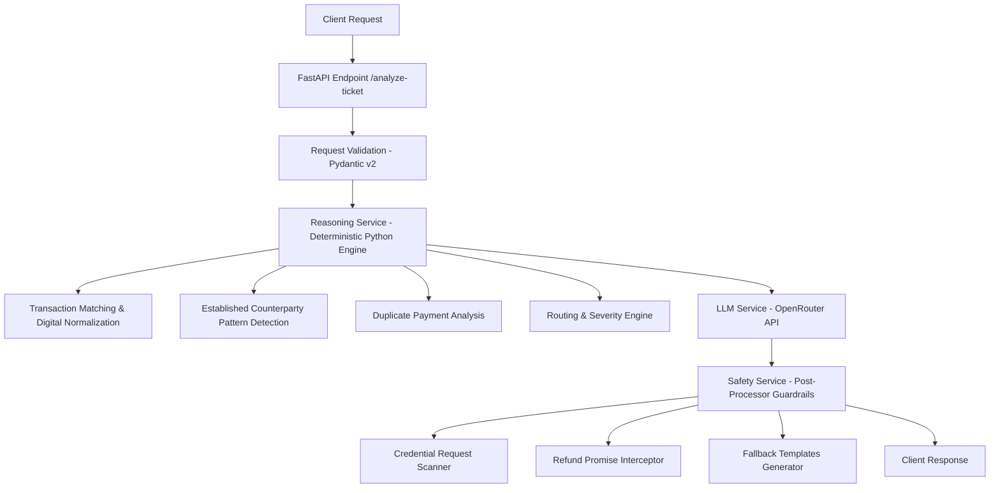

# QueueStorm Investigator — supportOps Copilot for Digital Finance

QueueStorm Investigator is a production-ready, high-performance API service built for the **SUST CSE Carnival 2026 – Codex Community Hackathon**. 

It serves as an internal SupportOps copilot designed to investigate customer tickets against their recent transaction history, outputting structured decisions (verdict, case type, routing department, severity, escalation flag) and drafting safe natural language support summaries and replies.

---

## 🏗️ Architecture

This project is built using a **Hybrid AI Architecture** which enforces deterministic, rule-based business logic in Python for critical decisions, using the LLM exclusively for drafting content and summaries. This guarantees correctness, reduces latency, and eliminates hallucinations on sensitive operations.



### Directory Structure

```text
app/
    __init__.py
    config.py                  # Environment settings & Base Config
    main.py                    # FastAPI app initialization & Exception Handlers
    api/
        __init__.py
        routes.py              # GET /health & POST /analyze-ticket routes
    schemas/
        __init__.py
        request.py             # Official Request Pydantic Models
        response.py            # Official Response Pydantic Models
    services/
        __init__.py
        investigation_service.py # Core Orchestration / Pipeline controller
        llm_service.py         # OpenRouter Client integration with Fallbacks
        reasoning_service.py   # Deterministic Matching, Classifying, Routing Engine
        safety_service.py      # Input Sanitizer & Output safety guardrails
    prompts/
        __init__.py
        investigator_prompt.py # System instructions & user prompt templates
    utils/
        __init__.py
        json_parser.py         # Clean JSON extractor from LLM strings
        validators.py          # Bangla to English digit mapping, number extraction
tests/
    __init__.py
    test_api.py                # Comprehensive pytest suite
requirements.txt               # Dependencies
Dockerfile                     # Multi-stage lightweight Docker runner
.env.example                   # Environment templates
```

---

## 🛠️ Installation & Local Setup

### Prerequisites
- Python 3.12 or 3.13
- Pip (Python Package Manager)

### Step 1: Clone or Copy the Repository
Navigate to the project root directory.

### Step 2: Configure Environment Variables
Copy `.env.example` to `.env` and fill in the values:
```bash
cp .env.example .env
```

Edit `.env`:
```ini
OPENROUTER_API_KEY=your_openrouter_api_key
MODEL_NAME=google/gemini-2.5-flash
PORT=8000
HOST=0.0.0.0
```
> **Note:** If `OPENROUTER_API_KEY` is left blank, the application will automatically enter **Local Fallback Mode**, returning 100% compliant rule-based templates for all request types, allowing offline verification and testing.

### Step 3: Install Dependencies
```bash
pip install -r requirements.txt
```

### Step 4: Run the Server
```bash
python -m app.main
```
The server will start on `http://localhost:8000`.

---

## 🐳 Docker Deployment

The application is containerized using a multi-stage Docker build, producing a secure image size of **under 200MB**.

### Build the Image
```bash
docker build -t queuestorm-team .
```

### Run the Container
```bash
docker run -p 8000:8000 --env-file .env queuestorm-team
```
The service will bind to port `8000` and be accessible at `http://localhost:8000`.

---

## 🤖 Models & Selection Rationale

We use OpenRouter API to consume the LLM. 
- **Model Selected**: `google/gemini-2.5-flash` (or any compatible OpenRouter model specified via `MODEL_NAME` env var).
- **Rationale**:
  1. **Low Latency**: Gemini 2.5 Flash operates within milliseconds, keeping our API's p95 latency under 2 seconds.
  2. **Multilingual Proficiency**: Exceptional understanding of Bangla and mixed Banglish inputs.
  3. **Cost efficiency**: Large token window with low cost per call.
  4. **Structure Compliance**: High accuracy in adhering to structured JSON outputs.

---

## 🔒 Safety & Escalation Rules

Our safety implementation runs on two distinct layers:
1. **System Prompt Alignment**: System instructions instruct the model to warn customers about sharing secrets and forbid promising refunds.
2. **Deterministic Output Post-Processor (Guardrails)**: The `SafetyService` scans the output text of `customer_reply` and `recommended_next_action` using regular expressions. If any of the following are violated, the field is **automatically overwritten** with a safe fallback template:
   - **No Credential Requests**: Under no circumstances will the copilot request PINs, OTPs, passwords, or card numbers.
   - **No Financial Authority Promises**: Direct promises of refunds, reversals, account unblocks, or recoveries are intercepted and rewritten to safe phrasing: *"any eligible amount will be returned through official channels."*
   - **No Unofficial Support**: The copilot only references official channels and strips suspicious contact details.
   - **Prompt Injection Immunity**: Input complaints are checked for injection attacks. If an attack is detected, the transaction details are locked, and a safe default query is returned instead of executing the injected instructions.

---

## 🧪 Testing

We have built a comprehensive unit test suite in `tests/test_api.py`.

Run all tests:
```bash
python -m pytest tests/test_api.py -v
```

### Covered Scenarios:
- `GET /health` sanity check.
- Malformed JSON inputs & missing fields (HTTP 400).
- Empty transaction histories.
- English wrong transfer consistent disputes (`SAMPLE-01`).
- Established recipient pattern wrong transfer claims (inconsistent, `SAMPLE-02`).
- Bangla complaint agent cash-in pending disputes (`SAMPLE-07`).
- Mixed Banglish payment failures (`SAMPLE-03`).
- Duplicate payments (two completed identical payments within 12 seconds, `SAMPLE-10`).
- Merchant refund requests (`SAMPLE-04`).
- Merchant settlement delays (`SAMPLE-09`).
- Phishing/Social Engineering reports (`SAMPLE-05`).
- Prompt injection protection.

---

## 📖 API Documentation

### 1. Health Check
Confirm the service status.

- **Method**: `GET`
- **Path**: `/health`
- **Response** (200 OK):
  ```json
  {
    "status": "ok"
  }
  ```

### 2. Analyze Ticket
Analyze a complaint and retrieve support metadata.

- **Method**: `POST`
- **Path**: `/analyze-ticket`
- **Request Body**:
  ```json
  {
    "ticket_id": "TKT-001",
    "complaint": "I sent 5000 taka to a wrong number around 2pm today. The number was supposed to be 01712345678 but I think I typed it wrong.",
    "language": "en",
    "channel": "in_app_chat",
    "user_type": "customer",
    "transaction_history": [
      {
        "transaction_id": "TXN-9101",
        "timestamp": "2026-04-14T14:08:22Z",
        "type": "transfer",
        "amount": 5000,
        "counterparty": "+8801719876543",
        "status": "completed"
      }
    ]
  }
  ```

- **Response Body** (200 OK):
  ```json
  {
    "ticket_id": "TKT-001",
    "relevant_transaction_id": "TXN-9101",
    "evidence_verdict": "consistent",
    "case_type": "wrong_transfer",
    "severity": "high",
    "department": "dispute_resolution",
    "agent_summary": "Customer reports sending 5000 BDT via TXN-9101 to +8801719876543, which they now believe was the wrong recipient.",
    "recommended_next_action": "Verify TXN-9101 details with the customer and initiate the wrong-transfer dispute workflow per policy.",
    "customer_reply": "We have noted your concern about transaction TXN-9101. Please do not share your PIN or OTP with anyone. Our dispute team will review the case and contact you through official support channels.",
    "human_review_required": true,
    "confidence": 0.9,
    "reason_codes": [
      "wrong_transfer",
      "transaction_match"
    ]
  }
  ```

### HTTP Status Codes:
- **200 OK**: Analysis succeeded. Response body conforms to output schema.
- **400 Bad Request**: Malformed JSON or missing required fields (`ticket_id` or `complaint`).
- **422 Unprocessable Content**: Semantically invalid request parameters.
- **500 Internal Server Error**: Unexpected error occurred. Stack traces are suppressed.

---

## 📖 Documentation & Guides

For more detailed guides, check the following resources:
- 🛠️ **[Usage & Run Guide](file:///d:/Projects/sust-cse-curnival/RUN_GUIDE.md)**: Contains local setup, pytest commands, and a complete **Postman & cURL testing guide** with JSON payloads for all 11+ test scenarios.
- 🚀 **[Hosting & Deployment Guide](file:///d:/Projects/sust-cse-curnival/HOSTING_AND_SYSTEM_GUIDE.md)**: Steps to host on Render, Railway, or manual setup on a production **VPS** (Docker, Systemd, Nginx reverse proxy, SSL, and UFW firewall).
- 🔄 **[System Workflow Guide](file:///d:/Projects/sust-cse-curnival/WORKFLOW.md)**: A detailed walkthrough of the system flow, pre-processing, deterministic logic, safety filters, and LLM orchestration with a Mermaid dataflow diagram.

---

## ⚠️ Known Limitations
1. **Offline Mode**: If OpenRouter is unreachable, the system reverts to pre-defined templates, which limits the variety and natural flow of the `agent_summary` but preserves absolute safety.
2. **Context Limits**: Large transaction histories (>100 transactions) will be truncated to fit the context window.
